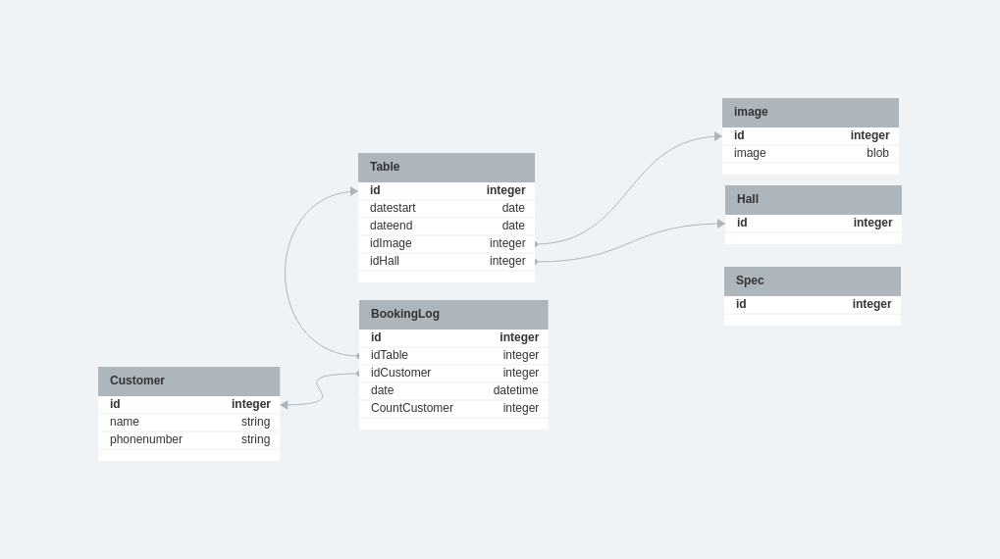
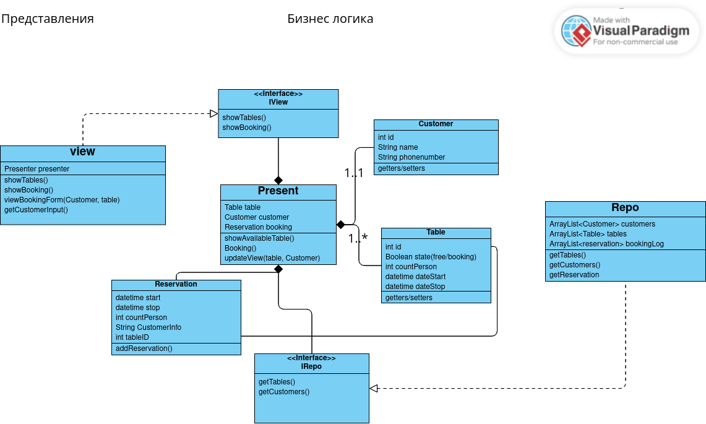
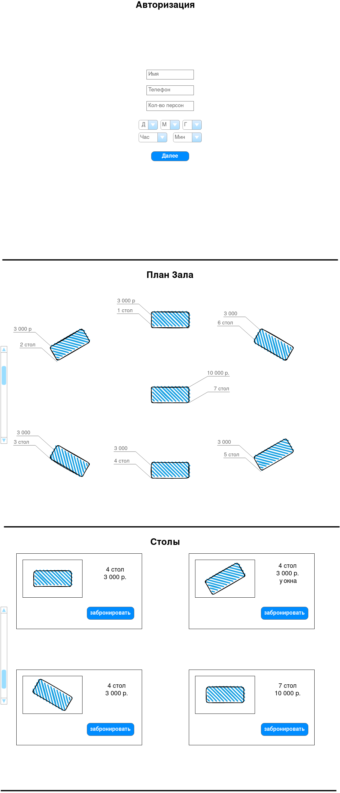

### имеем представление(view), которое отвечает за пользовательский ввод, вывод актуальной иинформации о cтолах и брони стола
### презентер на основе полученных данных проверяет наличие свободного стола, и отдает обновленныю информацию клиенту
## repo хранит все данные

